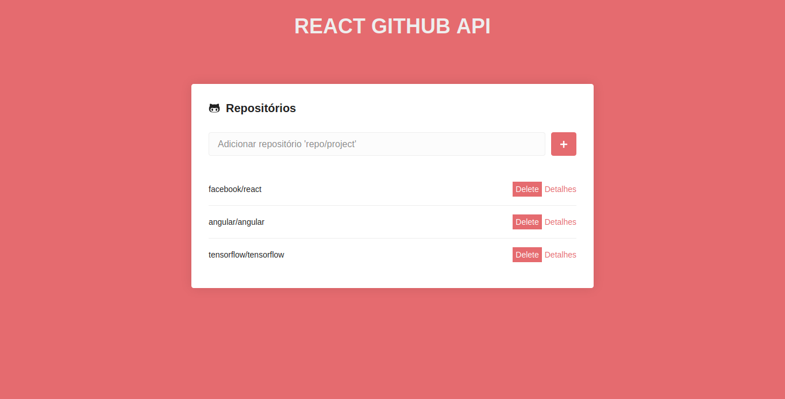

## Introduction

This project was done in order to learn more about how the react components and life cycle work. Using classes and functions consuming the api provided by github.

## Packets use

- **react-router-dom**
- **styled-components**
- **react-icons**
- **axios**
- **prop-types**

## Who use
```
$ git clone https://github.com/PequenoJoohn/react-github.git
$ cd react-github
$ yarn
```

## Available Scripts

In the project directory, you can run:

### `yarn start`

Runs the app in the development mode.<br />
Open [http://localhost:3000](http://localhost:3000) to view it in the browser.

The page will reload if you make edits.<br />
You will also see any lint errors in the console.
